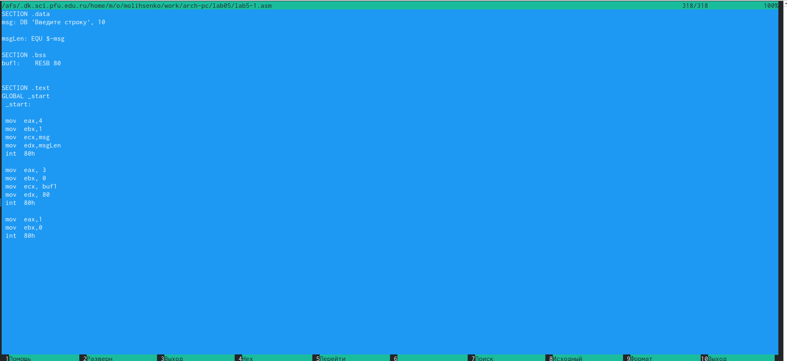
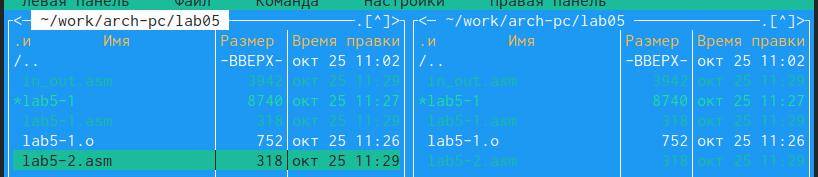

---
## Front matter
title: "Отчёт по лабораторной работе №5"
subtitle: "Дисциплина: Архитектура компьютера"
author: "Лысенко Маргарита Олеговна"

## Generic otions
lang: ru-RU
toc-title: "Содержание"

## Bibliography
bibliography: bib/cite.bib
csl: pandoc/csl/gost-r-7-0-5-2008-numeric.csl

## Pdf output format
toc: true # Table of contents
toc-depth: 2
lof: true # List of figures
lot: true # List of tables
fontsize: 12pt
linestretch: 1.5
papersize: a4
documentclass: scrreprt
## I18n polyglossia
polyglossia-lang:
  name: russian
  options:
	- spelling=modern
	- babelshorthands=true
polyglossia-otherlangs:
  name: english
## I18n babel
babel-lang: russian
babel-otherlangs: english
## Fonts
mainfont: PT Serif
romanfont: PT Serif
sansfont: PT Sans
monofont: PT Mono
mainfontoptions: Ligatures=TeX
romanfontoptions: Ligatures=TeX
sansfontoptions: Ligatures=TeX,Scale=MatchLowercase
monofontoptions: Scale=MatchLowercase,Scale=0.9
## Biblatex
biblatex: true
biblio-style: "gost-numeric"
biblatexoptions:
  - parentracker=true
  - backend=biber
  - hyperref=auto
  - language=auto
  - autolang=other*
  - citestyle=gost-numeric
## Pandoc-crossref LaTeX customization
figureTitle: "Рис."
tableTitle: "Таблица"
listingTitle: "Листинг"
lofTitle: "Список иллюстраций"
lotTitle: "Список таблиц"
lolTitle: "Листинги"
## Misc options
indent: true
header-includes:
  - \usepackage{indentfirst}
  - \usepackage{float} # keep figures where there are in the text
  - \floatplacement{figure}{H} # keep figures where there are in the text
---

# Цель работы

Приобретение практических навыков работы в Midnight Commander. Освоение инструкций
языка ассемблера mov и int.

# Задание

Создать программы с выводом приглашения 'Введите строку'.

# Теоретическое введение

Midnight Commander (или просто mc) — это программа, которая позволяет просматривать
структуру каталогов и выполнять основные операции по управлению файловой системой,
т.е. mc является файловым менеджером. Midnight Commander позволяет сделать работу с
файлами более удобной и наглядной.
Для активации оболочки Midnight Commander достаточно ввести в командной строке mc и
нажать клавишу Enter.
В Midnight Commander используются функциональные клавиши F1 — F10 , к которым
привязаны часто выполняемые операции

# Выполнение лабораторной работы

Открыла Midnight Commander. Перешла в каталог ~/work/arch-pc, созданный при выполнении лабораторной работы №4. С помощью функциональной клавиши F7 создала папку lab05 и перешла
в созданный каталог. (рис. @fig:001).

{#fig:001 width=70%}

Пользуясь строкой ввода и командой touch создала файл lab5-1.asm  (рис. @fig:002).

{#fig:002 width=70%}

С помощью функциональной клавиши F4 открыла файл lab5-1.asm для редактирования во встроенном редакторе. Ввела текст программы, сохранила изменения. С помощью функциональной клавиши F3 открыла файл lab5-1.asm для просмотра. Убедилась, что файл содержит текст программы. (рис. @fig:003).

{#fig:003 width=70%}

Оттранслировала текст программы lab5-1.asm в объектный файл. Выполнила компоновку объектного файла и запустила получившийся исполняемый файл.Программа выводит строку 'Введите строку:' и ожидает ввода с клавиатуры. На запрос ввела мои ФИО (рис. @fig:004).

{#fig:004 width=70%}

Скачала файл in_out.asm со страницы курса в ТУИС. Перенесла файл в тот же каталог, где лежит файл с программой. (рис. @fig:005).

{#fig:005 width=70%}

С помощью функциональной клавиши F6 создала копию файла lab5-1.asm с именем lab5-2.asm.  (рис. @fig:006).

{#fig:006 width=70%}

Исправила текст программы в файле lab5-2.asm с использованием подпрограмм из
внешнего файла in_out.asm. Создала исполняемый файл и проверила его работу. (рис. @fig:007).

{#fig:007 width=70%}

В файле lab5-2.asm заменила подпрограмму sprintLF на sprint.  (рис. @fig:008).

{#fig:008 width=70%}

Создала исполняемый файл и проверила его работу. Теперь ввод производится на той же строке, что и вывод, убран символ перевода строки после вывода.  (рис. @fig:009).

{#fig:009 width=70%}

# Выполнение самостоятельной работы

Создала копию файла lab5-1.asm.  (рис. @fig:010).

{#fig:010 width=70%}

Внесла изменения в программу (без использования внешнего файла in_out.asm), так чтобы она работала по следующему алгоритму:
• вывести приглашение типа “Введите строку:”;
• ввести строку с клавиатуры;
• вывести введённую строку на экран. (рис. @fig:011).

{#fig:011 width=70%}

Получила исполняемый файл и проверила его работу. На приглашение ввести строку
ввела свою фамилию. (рис. @fig:012).

{#fig:012 width=70%}

Листинг написанной программы:

```
SECTION .data
msg: DB 'Введите строку', 10

msgLen: EQU $-msg

SECTION .bss
buf1:    RESB 80


SECTION .text
GLOBAL _start
 _start:
 
 mov  eax,4
 mov  ebx,1
 mov  ecx,msg
 mov  edx,msgLen
 int  80h
 
 mov  eax, 3
 mov  ebx, 0
 mov  ecx, buf1
 mov  edx, 80
 int  80h
 
 mov  eax,4
 mov  ebx,1
 mov  ecx,buf1
 mov  edx,buf1
 int  80h
 
 mov  eax,1
 mov  ebx,0
 int  80h
```
 
 
Создала копию файла lab5-2.asm. Исправила текст программы с использование подпрограмм из внешнего файла in_out.asm, так чтобы она работала по следующему
алгоритму:
• вывести приглашение типа “Введите строку:”;
• ввести строку с клавиатуры;
• вывести введённую строку на экран. (рис. @fig:013).

{#fig:013 width=70%}

Создала исполняемый файл и проверила его работу (рис. @fig:014).

{#fig:014 width=70%}

Листинг написанной программы:


```
%include 'in_out.asm'

SECTION .data
msg: DB 'Введите строку', 10

msgLen: EQU $-msg

SECTION .bss
buf1:    RESB 80


SECTION .text
GLOBAL _start
 _start:
 
 mov  eax,msg
 call sprint
 
 mov  ecx,buf1
 mov  edx,80
 
 call sread
 mov  eax, 4
 mov  ebx, 1
 mov  ecx, buf1
 int  80h
 call quit
```

# Выводы

В ходе лабораторной и самостоятельной работ мы приобрели практические навыки работы в Midnight Commander; освоили инструкции языка ассемблера mov и int.
