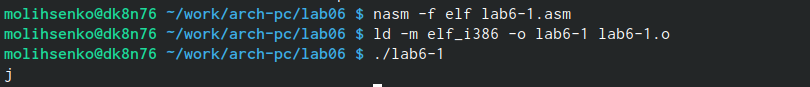
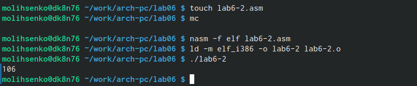
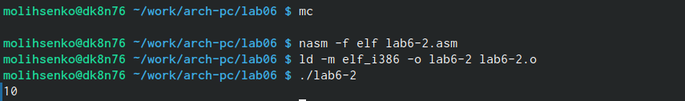
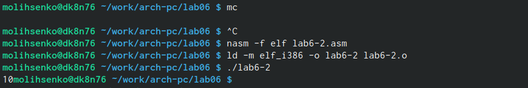
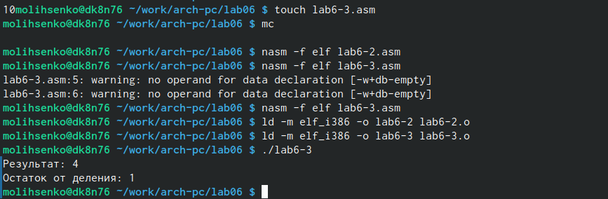
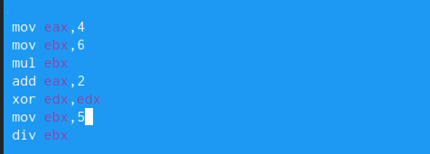
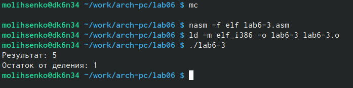
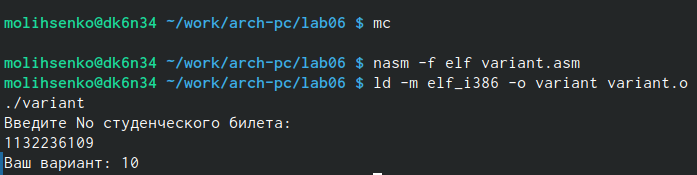
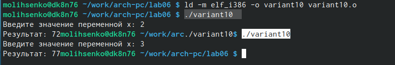

---
## Front matter
title: "Отчёт по выполнению лабораторной работы №6"
subtitle: "Дисциплина: архитектура компьютера"
author: "Лысенко Маргарита Олеговна"

## Generic otions
lang: ru-RU
toc-title: "Содержание"

## Bibliography
bibliography: bib/cite.bib
csl: pandoc/csl/gost-r-7-0-5-2008-numeric.csl

## Pdf output format
toc: true # Table of contents
toc-depth: 2
lof: true # List of figures
lot: true # List of tables
fontsize: 12pt
linestretch: 1.5
papersize: a4
documentclass: scrreprt
## I18n polyglossia
polyglossia-lang:
  name: russian
  options:
	- spelling=modern
	- babelshorthands=true
polyglossia-otherlangs:
  name: english
## I18n babel
babel-lang: russian
babel-otherlangs: english
## Fonts
mainfont: PT Serif
romanfont: PT Serif
sansfont: PT Sans
monofont: PT Mono
mainfontoptions: Ligatures=TeX
romanfontoptions: Ligatures=TeX
sansfontoptions: Ligatures=TeX,Scale=MatchLowercase
monofontoptions: Scale=MatchLowercase,Scale=0.9
## Biblatex
biblatex: true
biblio-style: "gost-numeric"
biblatexoptions:
  - parentracker=true
  - backend=biber
  - hyperref=auto
  - language=auto
  - autolang=other*
  - citestyle=gost-numeric
## Pandoc-crossref LaTeX customization
figureTitle: "Рис."
tableTitle: "Таблица"
listingTitle: "Листинг"
lofTitle: "Список иллюстраций"
lotTitle: "Список таблиц"
lolTitle: "Листинги"
## Misc options
indent: true
header-includes:
  - \usepackage{indentfirst}
  - \usepackage{float} # keep figures where there are in the text
  - \floatplacement{figure}{H} # keep figures where there are in the text
---

# Цель работы

Освоение арифметических инструкций языка ассемблера NASM.

# Задание

Задать некоторые уровнения через консоль.

# Теоретическое введение

Большинство инструкций на языке ассемблера требуют обработки операндов. Адрес опе-
ранда предоставляет место, где хранятся данные, подлежащие обработке. Это могут быть
данные хранящиеся в регистре или в ячейке памяти. Далее рассмотрены все существующие
способы задания адреса хранения операндов – способы адресации.
Существует три основных способа адресации:
• Регистровая адресация – операнды хранятся в регистрах и в команде используются
имена этих регистров, например: mov ax,bx.
• Непосредственная адресация – значение операнда задается непосредственно в ко-
манде, Например: mov ax,2.
• Адресация памяти – операнд задает адрес в памяти. В команде указывается символи-
ческое обозначение ячейки памяти, над содержимым которой требуется выполнить
операцию.
Например, определим переменную intg DD 3 – это означает, что задается область памяти
размером 4 байта, адрес которой обозначен меткой intg. В таком случае, команда
mov eax,[intg]
копирует из памяти по адресу intg данные в регистр eax. В свою очередь команда
mov [intg],eax
запишет в память по адресу intg данные из регистра eax.
Также рассмотрим команду
mov eax,intg
В этом случае в регистр eax запишется адрес intg. Допустим, для intg выделена память
начиная с ячейки с адресом 0x600144, тогда команда mov eax,intg аналогична команде mov
eax,0x600144 – т.е. эта команда запишет в регистр eax число 0x600144.

# Выполнение лабораторной работы

Создала каталог для программам лабораторной работы No 6, перещла в него и
создала файл lab6-1.asm. Ввела в него lab6-1.asm текст программы из листинга 6.1. Создала исполняемый файл и запустила его.(рис. @fig:001).

{#fig:001 width=70%}

Далее изменила текст программы и вместо символов, записала в регистры числа. (рис. @fig:002).

{#fig:002 width=70%}

Создала исполняемый файл и запустила его. Символ на экране не отображается.(рис. @fig:003).

{#fig:003 width=70%}

Создала файл lab6-2.asm в каталоге ~/work/arch-pc/lab06 и ввела в него текст программы из листинга 6.2. Запустила файл. В результате работы программы получила число 106.(рис. @fig:004).

{#fig:004 width=70%}

Аналогично предыдущему примеру изменила символы на числа. (рис. @fig:005).

{#fig:005 width=70%}

Создала исполняемый файл и запустила его. Теперь программа складывает сами числа, поэтому получается вывод 10. (рис. @fig:006).

{#fig:006 width=70%}

Заменила функцию iprintLF на iprint. (рис. @fig:007).
  
{#fig:007 width=70%}

Создала исполняемый файл и запустила его. Теперь вывод не пишется на отдельной строке. Iprint не добавляет к выводу символ переноса строки, в отличае от iprintLF. (рис. @fig:008).

{#fig:008 width=70%}

Создала файл lab6-3.asm. Создала исполняемый файл и запустила его. (рис. @fig:009).

{#fig:009 width=70%}

Изменила текст программы для вычисления выражения f(x) = (4 * 6 + 2)/5. (рис. @fig:010).

{#fig:010 width=70%}

Создала исполняемый файл и проверила его работу. (рис. @fig:011).

{#fig:011 width=70%}

Создала файл variant.asm и запустила его. Проверила результат работы программы, вычислив номер варианта аналитически. (рис. @fig:012).

{#fig:012 width=70%}

# Ответы на вопросы

1. За вывод сообщения "Ваш вариант" отвечают строки кода:

mov eax,rem
call sprint

2. mov ecx,x используется, чтобы положить адрес вводимой строки х в регистр ecx. mov edx,80 - запись в регистр edx длины вводимой строки. call ssread - вызов подпрограммы из внешнего файла, обеспечивающий ввод сообщения с клавиатуры.

3. call atoi используется для вызова подпрограммы из внешнего файла, которая преобразует ascii-код символа в целое число и записывает результат в регистр eax.

4. За вычисление варианта отвечают:

xor edx,edx
mov ebx
div ebx
inc edx

5. Остаток от деления записывается в регистр edx

6. inc edx увеличивает значение регистра edx на 1. 

7. За вывод на экран результатов вычислений отвечают строки:

mov eax,edx
call iprintLF

# Выполнение самостоятельной работы

Создала файл variant10.asm. Ввела в него текст программы для вычисления выражения 5(х+18)-28. Запустила исполняемый файл. Подставила разные значения х и получила ответы. (рис. @fig:013).

{#fig:013 width=70%}

# Листинг написанной программы для самостоятельной работы

```
%include 'in_out.asm' 
SECTION .data
msg: DB 'Введите значение переменной x: ',0
rem: DB 'Результат: ',0
SECTION .bss
x: RESB 80
SECTION .text
GLOBAL _start
_start:
; Вычисление выражения
mov eax, msg
call sprint
mov ecx, x
mov edx, 80
call sread
mov eax,x ; вызов подпрограммы преобразования
call atoi ; ASCII кода в число, `eax=x`
add eax,18; eax = eax+18 = x+18
mov ebx,5
mul ebx; EAX=EAX*EBX = (x+18)*5
sub eax, 28; eax = eax-28 = (x+18)*5-28
mov edi,eax
; Вывод результата на экран
mov eax,rem ; вызов подпрограммы печати
call sprint ; сообщение 'Результат: '
mov eax,edi ; вызов подпрограммы печати значения
call iprint ; из 'edi' в виде символов
call quit
```


# Выводы

В ходе выполнения работ я освоенила арифметические инструкции языка ассемблера NASM.
