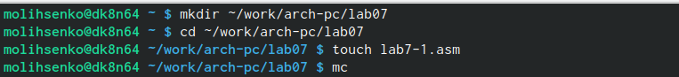
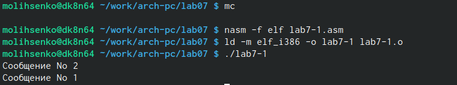
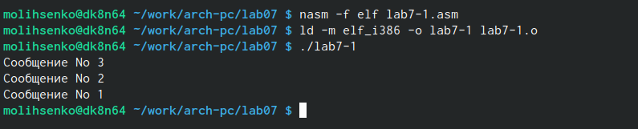
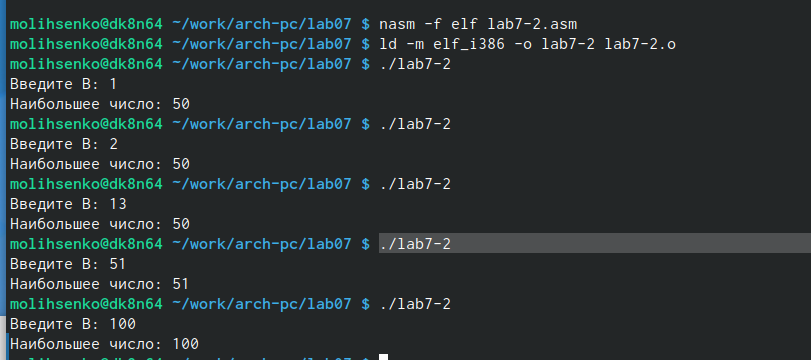
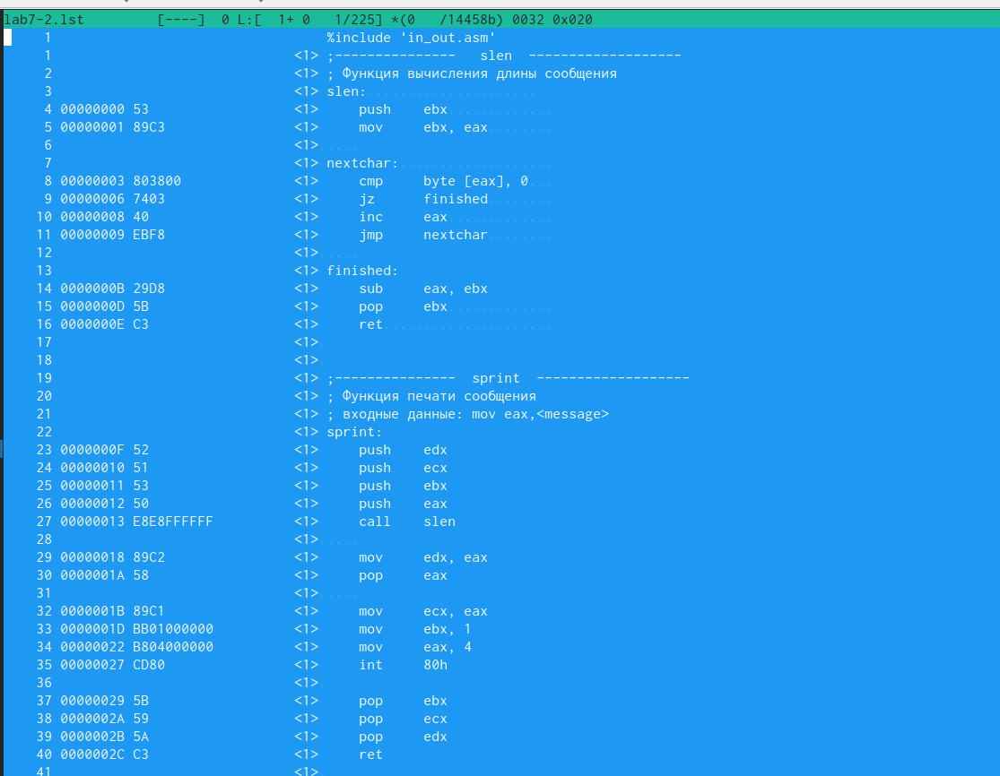
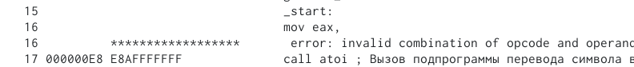
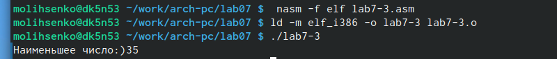
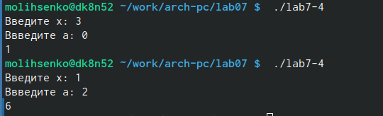

---
## Front matter
title: "Отчёт по выполнению лабораторной работы №7"
subtitle: "Дисциплина: архитектура компьютера"
author: "Лысенко Маргарита Олеговна"

## Generic otions
lang: ru-RU
toc-title: "Содержание"

## Bibliography
bibliography: bib/cite.bib
csl: pandoc/csl/gost-r-7-0-5-2008-numeric.csl

## Pdf output format
toc: true # Table of contents
toc-depth: 2
lof: true # List of figures
lot: true # List of tables
fontsize: 12pt
linestretch: 1.5
papersize: a4
documentclass: scrreprt
## I18n polyglossia
polyglossia-lang:
  name: russian
  options:
	- spelling=modern
	- babelshorthands=true
polyglossia-otherlangs:
  name: english
## I18n babel
babel-lang: russian
babel-otherlangs: english
## Fonts
mainfont: PT Serif
romanfont: PT Serif
sansfont: PT Sans
monofont: PT Mono
mainfontoptions: Ligatures=TeX
romanfontoptions: Ligatures=TeX
sansfontoptions: Ligatures=TeX,Scale=MatchLowercase
monofontoptions: Scale=MatchLowercase,Scale=0.9
## Biblatex
biblatex: true
biblio-style: "gost-numeric"
biblatexoptions:
  - parentracker=true
  - backend=biber
  - hyperref=auto
  - language=auto
  - autolang=other*
  - citestyle=gost-numeric
## Pandoc-crossref LaTeX customization
figureTitle: "Рис."
tableTitle: "Таблица"
listingTitle: "Листинг"
lofTitle: "Список иллюстраций"
lotTitle: "Список таблиц"
lolTitle: "Листинги"
## Misc options
indent: true
header-includes:
  - \usepackage{indentfirst}
  - \usepackage{float} # keep figures where there are in the text
  - \floatplacement{figure}{H} # keep figures where there are in the text
---

# Цель работы

Изучение команд условного и безусловного переходов. Приобретение навыков написания
программ с использованием переходов. Знакомство с назначением и структурой файла
листинга.

# Задание

Разобраться в командах условного и безусловного переходов.

# Теоретическое введение

Для реализации ветвлений в ассемблере используются так называемые команды передачи
управления или команды перехода. Можно выделить 2 типа переходов:
• условный переход – выполнение или не выполнение перехода в определенную точку
программы в зависимости от проверки условия.
• безусловный переход – выполнение передачи управления в определенную точку про-
граммы без каких-либо условий.

# Выполнение лабораторной работы

Создала каталог для программам лабораторной работы № 7, перешла в него и со-
здала файл lab7-1.asm (рис. @fig:001).

{#fig:001 width=70%}

Ввела программу из листинга 7.1. Создала исполняемый файл и запустила его. (рис. @fig:002).

{#fig:002 width=70%}

Изменила программу так, чтобы сначала выводилась 2, а потом 3 (рис. @fig:003).

{#fig:003 width=70%}

Изменила текст программы в соответсвии с листингом 7.2. Создала исполняемый файл и проверила его работу. Изменила текст программы добавив или изменив инструкции jmp, чтобы вывод програм-
мы был следующим:
user@dk4n31:~$ ./lab7-1
Сообщение № 3
Сообщение № 2
Сообщение № 1
user@dk4n31:~$ (рис. @fig:004).

{#fig:004 width=70%}

Создала  файл lab7-2.asm в каталоге ~/work/arch-pc/lab07. Внимательно изучила текст
программы из листинга 7.3 и ввела в lab7-2.asm. Создала исполняемый файл и проверила его работу для разных значений B. (рис. @fig:005).

{#fig:005 width=70%}

Открыла файл листинга lab7-2.lst с помощью текстового редактора. Внимательно ознакомилась с его форматом и содержимым. 
В строке 9 содержится собственно номер сторки [9], адресс [00000003], машинный код [803800] и содержимое строки кода [cmp byte [eax], 0] в строке 11 содержится номер сторки [11], адресс [00000008], машинный код [40] и содержимое строки кода [inc eax] в строке 24 содержится номер сторки [24], адресс [0000000F], машинный код [52] и содержимое строки кода [push edx] (рис. @fig:006).

{#fig:006 width=70%}

В инструкции с двумя операндами удалила один операнд. Выполнила трансляцию с получением файла листинга:
nasm -f elf -l lab7-2.lst lab7-2.asm 
Видно, что ели в коде появляется ошибка, то ее видно в листинге. (рис. @fig:007).

{#fig:007 width=70%}

# Выполнение самостоятельной работы

Написала программу нахождения наименьшей из 3 целочисленных переменных а,b и с.
Значения переменных выбрать из табл. 7.5 в соответствии с вариантом 10.  Создала исполняемый файл и проверила его работу. (рис. @fig:008).

{#fig:008 width=70%}

Написала программу, которая для введенных с клавиатуры значений 𝑥 и 𝑎 вычисляет
значение заданной функции 𝑓(𝑥) и выводит результат вычислений. Вид функции 𝑓(𝑥)
выбрала из таблицы 7.6 вариантов заданий в соответствии с вариантом 10. Создала исполняемый файл и проверила его работу для значений 𝑥 и 𝑎 . (рис. @fig:009).

{#fig:009 width=70%}

# Листинги программ 

```
%include 'in_out.asm'

section .data
    msg1 db "Наименьшее число:"
    a dd 41
    b dd 62
    c dd 35

section .bss
    min resb 10

section .text
global _start

_start:
    mov eax, msg1
    call sprint

    mov ecx, [a]
    mov [min], ecx ; 'min = A'
    ; ---------- Сравниваем 'A' и 'С' (как числа)
    cmp ecx, [c] ; Сравниваем 'A' и 'С'
    jl check_B ; если 'A<C', то переход на метку 'check_B',
    mov ecx, [c] ; иначе 'ecx = C'
    mov [min], ecx ; 'min = C'
; ---------- Преобразование 'min(A,C)' из символа в число

check_B:
    ; ---------- Сравниваем 'min(A,C)' и 'B' (как числа)
    mov ecx, [min]
    cmp ecx, [b] ; Сравниваем 'min(A,C)' и 'B'
    jl fin ; если 'min(A,C)>B', то переход на 'fin',
    mov ecx, [b] ; иначе 'ecx = B'

    mov [min], ecx

; ---------- Вывод результата
fin:
    mov eax, [min]
    call iprintLF ; Вывод 'min(A,B,C)'
    call quit ; Выход
```

```
%include 'in_out.asm'

SECTION .data
input1 db "Введите х: ",0h
input2 db "Ввведите а: ",0h

SECTION .bss
max resb 10
x resb 10
a resb 10

SECTION .text
GLOBAL _start

_start:
mov eax,input1
call sprint

mov ecx,x
mov edx,10
call sread

mov eax,x
call atoi 
mov [x],eax 

mov eax,input2
call sprint

mov ecx,a
mov edx,10
call sread

mov eax,a
call atoi 
mov [a],eax 

mov ebx, 2
cmp [x], ebx
jle check

mov eax, [x]
mov ebx, 2
sub eax, ebx
call iprintLF
call quit

check:
mov eax, [a]
mov ebx, 3
imul ebx
call iprintLF
call quit
```


# Выводы
В ходе лабораторной и самостоятельной работ я изучила команды условного и безусловного переходов. Приобрела навыки написания программ с использованием переходов. Познакомилась с назначением и структурой файла листинга.

# Список литературы{.unnumbered}
