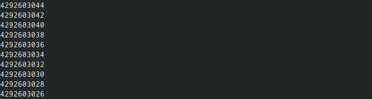

---
## Front matter
title: "Отчёт по лабораторной работе №8"
subtitle: "Дисциплина: архитектура компьютера"
author: "Лысенко Маргарита Олеговна"

## Generic otions
lang: ru-RU
toc-title: "Содержание"

## Bibliography
bibliography: bib/cite.bib
csl: pandoc/csl/gost-r-7-0-5-2008-numeric.csl

## Pdf output format
toc: true # Table of contents
toc-depth: 2
lof: true # List of figures
lot: true # List of tables
fontsize: 12pt
linestretch: 1.5
papersize: a4
documentclass: scrreprt
## I18n polyglossia
polyglossia-lang:
  name: russian
  options:
	- spelling=modern
	- babelshorthands=true
polyglossia-otherlangs:
  name: english
## I18n babel
babel-lang: russian
babel-otherlangs: english
## Fonts
mainfont: PT Serif
romanfont: PT Serif
sansfont: PT Sans
monofont: PT Mono
mainfontoptions: Ligatures=TeX
romanfontoptions: Ligatures=TeX
sansfontoptions: Ligatures=TeX,Scale=MatchLowercase
monofontoptions: Scale=MatchLowercase,Scale=0.9
## Biblatex
biblatex: true
biblio-style: "gost-numeric"
biblatexoptions:
  - parentracker=true
  - backend=biber
  - hyperref=auto
  - language=auto
  - autolang=other*
  - citestyle=gost-numeric
## Pandoc-crossref LaTeX customization
figureTitle: "Рис."
tableTitle: "Таблица"
listingTitle: "Листинг"
lofTitle: "Список иллюстраций"
lotTitle: "Список таблиц"
lolTitle: "Листинги"
## Misc options
indent: true
header-includes:
  - \usepackage{indentfirst}
  - \usepackage{float} # keep figures where there are in the text
  - \floatplacement{figure}{H} # keep figures where there are in the text
---

# Цель работы

Приобретение навыков написания программ с использованием циклов и обработкой
аргументов командной строки.

# Задание

Создать программу, которая находит сумму значений функции f(x) 

# Теоретическое введение

Стек — это структура данных, организованная по принципу LIFO («Last In — First Out»
или «последним пришёл — первым ушёл»). Стек является частью архитектуры процессора и
реализован на аппаратном уровне. Для работы со стеком в процессоре есть специальные
регистры (ss, bp, sp) и команды.
Основной функцией стека является функция сохранения адресов возврата и передачи
аргументов при вызове процедур. Кроме того, в нём выделяется память для локальных
переменных и могут временно храниться значения регистров.
Стек имеет вершину, адрес последнего добавленного элемента, который хранится в ре-
гистре esp (указатель стека). Противоположный конец стека называется дном. Значение,
помещённое в стек последним, извлекается первым. При помещении значения в стек указа-
тель стека уменьшается, а при извлечении — увеличивается.
Для стека существует две основные операции:
• добавление элемента в вершину стека (push);
• извлечение элемента из вершины стека (pop).

# Выполнение лабораторной работы

Создала каталог для программам лабораторной работы No 8, перешла в него и создала
файл lab8-1.asm. Ввела в файл lab8-1.asm текст программы из листинга 8.1. Создала исполняемый файл и провертла его работу.(рис. @fig:001).

{#fig:001 width=70%}

Изменила текст программы добавив изменение значение регистра ecx в цикле:
label:
sub ecx,1 ; `ecx=ecx-1`
mov [N],ecx
mov eax,[N]
call iprintLF
loop label 

программа работает некорректно(рис. @fig:002).

{#fig:002 width=70%}

Внесла изменения в текст программы добавив команды push и pop (добавления в стек и извлечения из стека) для сохранения значения счетчика цикла
loop:

```
label:
push ecx ; добавление значения ecx в стек
sub ecx,1
mov [N],ecx
mov eax,[N]
call iprintLF
pop ecx ; извлечение значения ecx из стека
loop label 
```
 (рис. @fig:003).

{#fig:003 width=70%}

Создала файл lab8-2.asm в каталоге ~/work/arch-pc/lab08 и ввела в него текст программы из листинга 8.2.
Создала исполняемый файл и запустила его, указав аргументы:
./lab8-2 аргумент1 аргумент 2 'аргумент 3' (рис. @fig:004).

{#fig:004 width=70%}

Создала файл lab8-3.asm в каталоге ~/work/arch-pc/lab08 и ввела в него текст программы из листинга 8.3. (рис. @fig:005).

{#fig:005 width=70%}


Изменила текст программы из листинга 8.3 для вычисления произведения аргументов командной строки. (рис. @fig:006).

{#fig:006 width=70%}


# Выполнение самостоятельной работы


Написала программу, которая находит сумму значений функции f(x) с разными значениями х (рис. @fig:007).

{#fig:007 width=70%}

#Листинг

```
%include 'in_out.asm'

SECTION .data
f_x db "функция: 5(2+x)",0h
msg db 10,13,'результат: ',0h

SECTION .text
global _start

_start:
pop ecx
pop edx
sub ecx,1
mov esi, 0

next:
cmp ecx,0h
jz _end
pop eax
call atoi
;dec eax
add eax,2
mov ebx, 5
mul ebx
add esi, eax

loop next

_end:
mov eax, f_x
call sprint
mov eax, msg
call sprint
mov eax, esi
call iprintLF

call quit
```


# Выводы
В проделанных лабораторной и самостоятельной работах мы риобрели навыки написания программ с использованием циклов и обработкой аргументов командной строки.

