---
## Front matter
title: "Отчёт по лабораторной работе №9"
subtitle: "Дисциплина: архитектура компьютера"
author: "Лысенко Маргарита Олеговна"

## Generic otions
lang: ru-RU
toc-title: "Содержание"

## Bibliography
bibliography: bib/cite.bib
csl: pandoc/csl/gost-r-7-0-5-2008-numeric.csl

## Pdf output format
toc: true # Table of contents
toc-depth: 2
lof: true # List of figures
lot: true # List of tables
fontsize: 12pt
linestretch: 1.5
papersize: a4
documentclass: scrreprt
## I18n polyglossia
polyglossia-lang:
  name: russian
  options:
	- spelling=modern
	- babelshorthands=true
polyglossia-otherlangs:
  name: english
## I18n babel
babel-lang: russian
babel-otherlangs: english
## Fonts
mainfont: PT Serif
romanfont: PT Serif
sansfont: PT Sans
monofont: PT Mono
mainfontoptions: Ligatures=TeX
romanfontoptions: Ligatures=TeX
sansfontoptions: Ligatures=TeX,Scale=MatchLowercase
monofontoptions: Scale=MatchLowercase,Scale=0.9
## Biblatex
biblatex: true
biblio-style: "gost-numeric"
biblatexoptions:
  - parentracker=true
  - backend=biber
  - hyperref=auto
  - language=auto
  - autolang=other*
  - citestyle=gost-numeric
## Pandoc-crossref LaTeX customization
figureTitle: "Рис."
tableTitle: "Таблица"
listingTitle: "Листинг"
lofTitle: "Список иллюстраций"
lotTitle: "Список таблиц"
lolTitle: "Листинги"
## Misc options
indent: true
header-includes:
  - \usepackage{indentfirst}
  - \usepackage{float} # keep figures where there are in the text
  - \floatplacement{figure}{H} # keep figures where there are in the text
---

# Цель работы

Приобретение навыков написания программ с использованием подпрограмм. Знакомство
с методами отладки при помощи GDB и его основными возможностями.

# Задание

С помощью отладчика GDB, анализируя изменения значений регистров, определить ошибку и исправить ее.

# Теоретическое введение

Отладка — это процесс поиска и исправления ошибок в программе. В общем случае его
можно разделить на четыре этапа:
• обнаружение ошибки;
• поиск её местонахождения;
• определение причины ошибки;
• исправление ошибки.
Можно выделить следующие типы ошибок:
• синтаксические ошибки — обнаруживаются во время трансляции исходного кода и
вызваны нарушением ожидаемой формы или структуры языка;
• семантические ошибки — являются логическими и приводят к тому, что программа
запускается, отрабатывает, но не даёт желаемого результата;
• ошибки в процессе выполнения — не обнаруживаются при трансляции и вызывают прерывание выполнения программы (например, это ошибки, связанные с переполнением
или делением на ноль).
Второй этап — поиск местонахождения ошибки. Некоторые ошибки обнаружить довольно трудно. Лучший способ найти место в программе, где находится ошибка, это разбить
программу на части и произвести их отладку отдельно друг от друга.
Третий этап — выяснение причины ошибки. После определения местонахождения ошибки
обычно проще определить причину неправильной работы программы.
Последний этап — исправление ошибки. После этого при повторном запуске программы,
может обнаружиться следующая ошибка, и процесс отладки начнётся заново.

# Выполнение лабораторной работы

Создала каталог для выполнения лабораторной работы № 9, перешла в него и создала файл lab09-1.asm. Ввела в файл lab09-1.asm текст программы из листинга 9.1. Создала исполняемый
файл и проверила его работу. (рис. @fig:001).

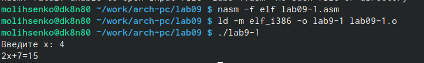{#fig:001 width=70%}

Изменила текст программы, добавив подпрограмму _subcalcul в подпрограмму _calcul,
для вычисления выражения f(g(x)), где x вводится с клавиатуры, f(x) = 2x + 7, g(x) =
3x − 1.  (рис. @fig:002).

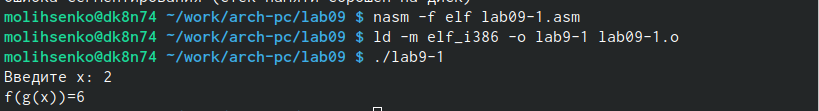{#fig:002 width=70%}

Создала файл lab09-2.asm. Загрузила исполняемый файл в отладчик gdb. Проверила работу программы, запустив ее в оболочке GDB с помощью команды run ( (рис. @fig:003).

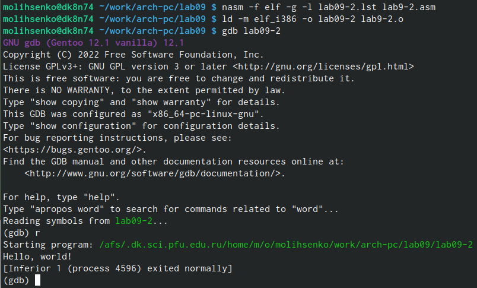{#fig:003 width=70%}

Для более подробного анализа программы установила брейкпоинт на метку _start, с
которой начинается выполнение любой ассемблерной программы, и запустила её. (рис. @fig:004).

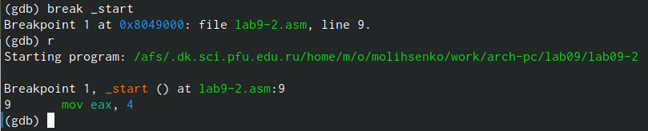{#fig:004 width=70%}

Посмотрела дисассимилированный код программы с помощью команды disassemble , начиная с метки _start (рис. @fig:005). 

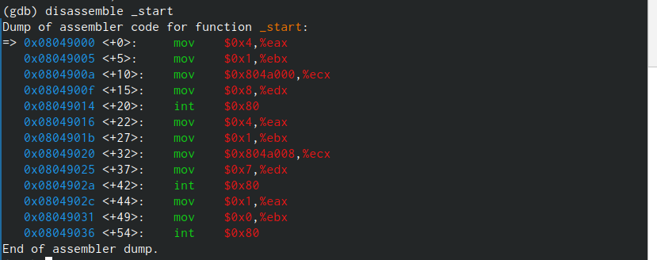{#fig:005 width=70%}

Переключилась на отображение команд с Intel’овским синтаксисом, введя команду set
disassembly-flavor intel (рис. @fig:006).

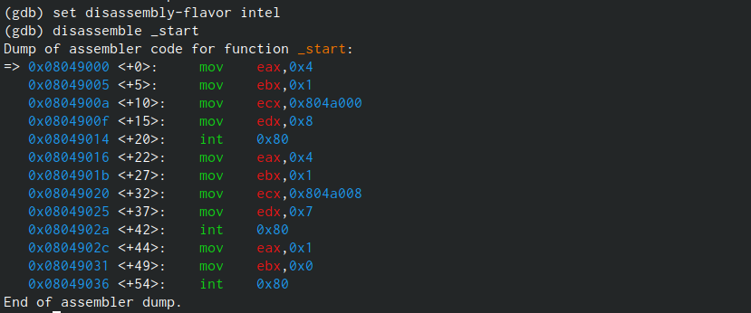{#fig:006 width=70%}

Включила режим псевдографики для более удобного анализа программы (рис. @fig:007).

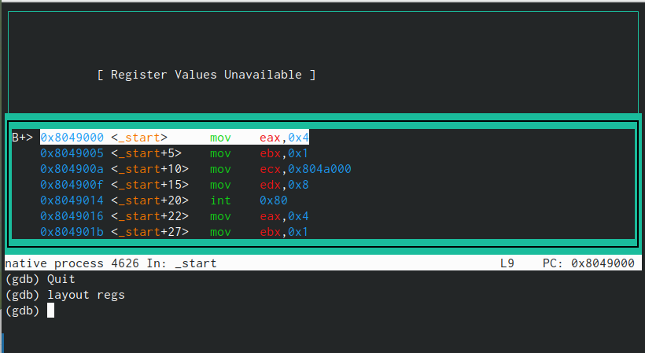{#fig:007 width=70%}

На предыдущих шагах была установлена точка останова по имени метки (_start). Проверила это с помощью команды info breakpoints. Установила еще одну точку останова по адресу инструкции.(рис. @fig:008).

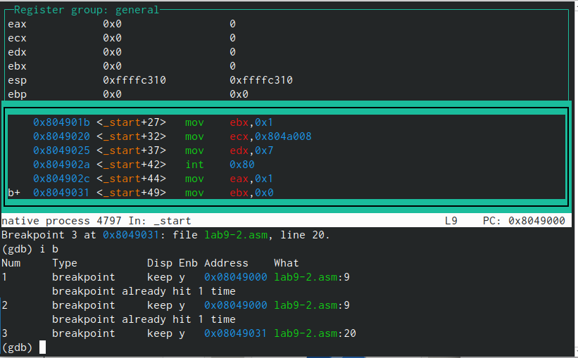{#fig:008 width=70%}

Посмотрела содержимое регистров также можно с помощью команды info registers(рис. @fig:009).

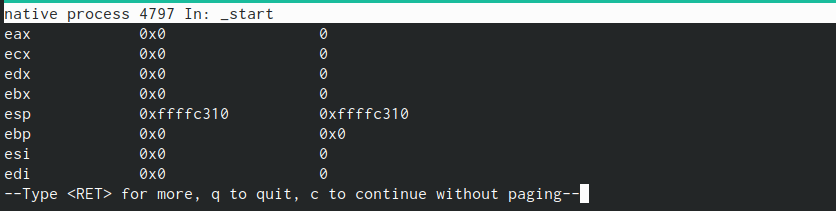{#fig:009 width=70%}

Посмотрите значение переменной msg1 по имени и переменной msg2 по адресу. (рис. @fig:010).

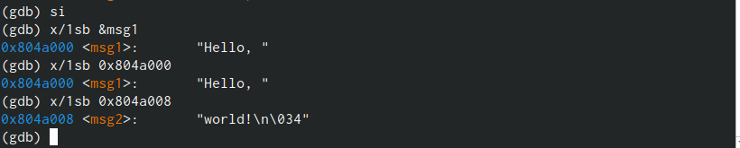{#fig:010 width=70%}

Изменила первый символ переменной msg1. Заменила любой символ во второй переменной msg2  (рис. @fig:011).

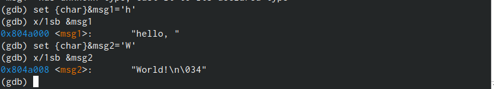{#fig:011 width=70%}

Вывела в различных форматах (в шестнадцатеричном формате, в двоичном формате и
в символьном виде) значение регистра edx. С помощью команды set изменила значение регистра ebx. (рис. @fig:012).

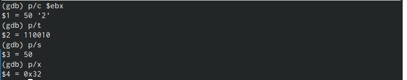{#fig:012 width=70%}

Скопировала файл lab8-2.asm, созданный при выполнении лабораторной работы №8,
с программой выводящей на экран аргументы командной строки в файл с именем lab09-3.asm. Создала исполняемый файл. Загрузила исполняемый файл в отладчик, указав аргументы  (рис. @fig:013).

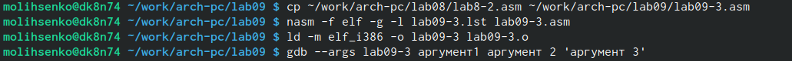{#fig:013 width=70%}

Для начала установила точку останова перед первой инструкцией в программе и запустила
ее. Адрес вершины стека храниться в регистре esp и по этому адресу располагается число
равное количеству аргументов командной строки. Число аргументов равно 5 – это имя программы lab09-3. Посмотрела остальные позиции стека – по адесу [esp+4] (рис. @fig:014).

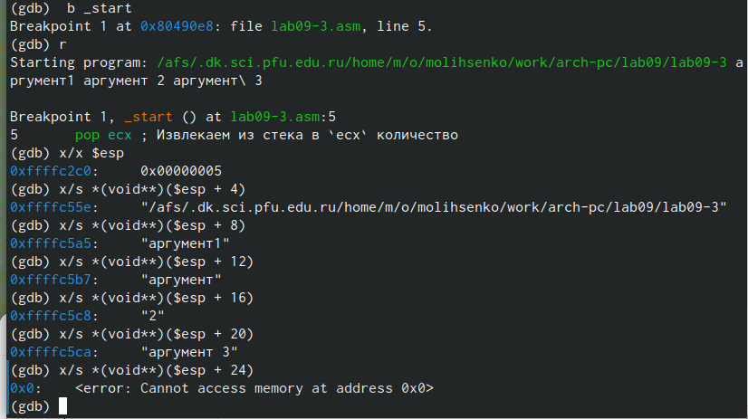{#fig:014 width=70%}

# Выполнение самостоятельной работы

Преобразовала программу из лабораторной работы №8, реализовав вычисление значения функции f(x) как подпрограмму (рис. @fig:015).

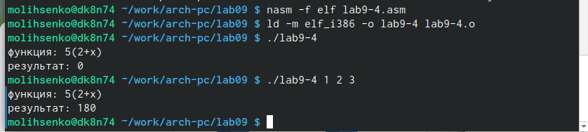{#fig:015 width=70%}

```
%include 'in_out.asm'

SECTION .data
f_x db "функция: 5(2+x)",0h
msg db 10,13,'результат: ',0h

SECTION .text
global _start

_f:
push ebx
dec eax
mov ebx, 10
mul ebx
pop ebx
ret

_start:
pop ecx
pop edx
sub ecx,1
mov esi, 0

next:
cmp ecx,0h
jz _end
pop eax
call atoi
call _f
add eax,2
mov ebx, 5
mul ebx
add esi, eax

loop next

_end:
mov eax, f_x
call sprint
mov eax, msg
call sprint
mov eax, esi
call iprintLF

call quit
```

При запуске данная программа дает неверный результат. Получается 10. С помощью отладчика GDB,
анализируя изменения значений регистров, определила ошибку и исправила ее. (рис. @fig:016).

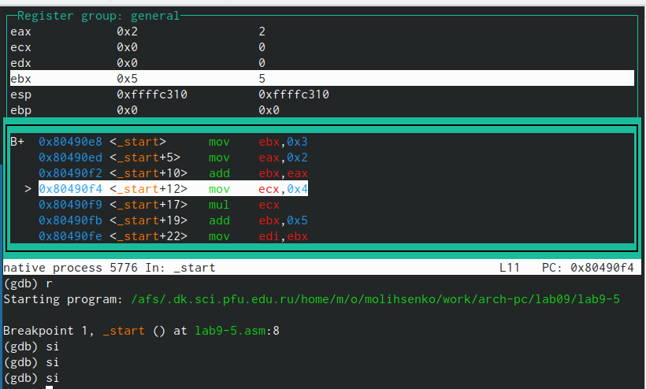{#fig:016 width=70%}

Проверила работу исправленной программы.Ошибки в строчках: 
add ebx, eax
mov ecx,4
mul ecx
add ebx,5 
mov edi,ebx       (рис. @fig:017).

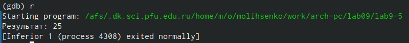{#fig:017 width=70%}

```
%include 'in_out.asm'
SECTION .data
div: DB 'Результат: ',0
SECTION .text
GLOBAL _start
_start:
; ---- Вычисление выражения (3+2)*4+5
mov ebx,3
mov eax,2
add eax,ebx
mov ecx,4
mul ecx
add eax,5
mov edi,eax
; ---- Вывод результата на экран
mov eax,div
call sprint
mov eax,edi
call iprintLF
call quit
```


# Выводы

В ходе выполнения работ я приобрела навыки написания программ с использованием подпрограмм. Пзнакомилась с методами отладки при помощи GDB и его основными возможностями.

