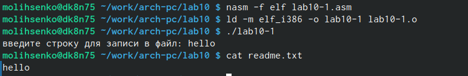
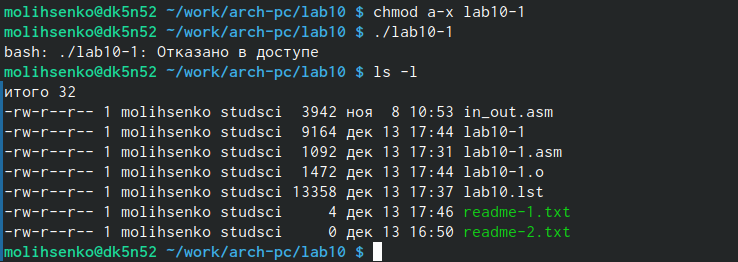
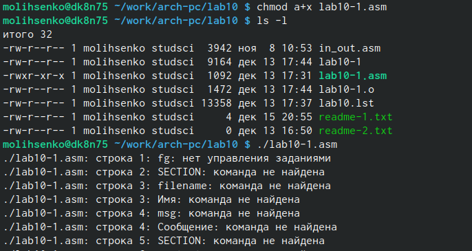
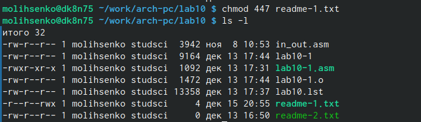
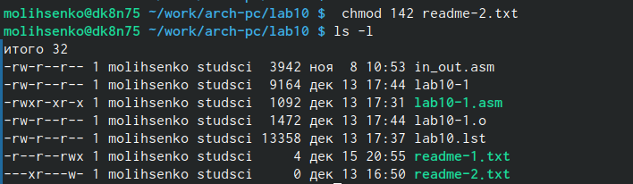
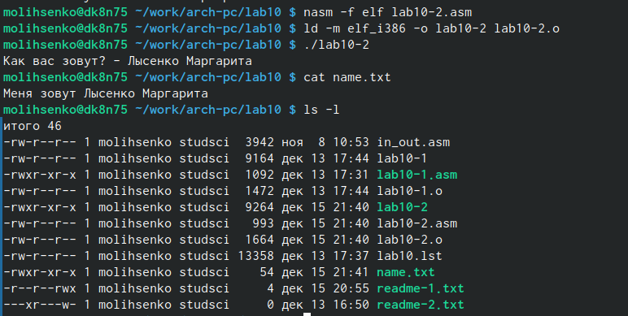

---
## Front matter
title: "Отчёт по лабораторной работе №10"
subtitle: "Дисциплина: архитектура компьютера"
author: "Лысенко Маргарита Олеговна"

## Generic otions
lang: ru-RU
toc-title: "Содержание"

## Bibliography
bibliography: bib/cite.bib
csl: pandoc/csl/gost-r-7-0-5-2008-numeric.csl

## Pdf output format
toc: true # Table of contents
toc-depth: 2
lof: true # List of figures
lot: true # List of tables
fontsize: 12pt
linestretch: 1.5
papersize: a4
documentclass: scrreprt
## I18n polyglossia
polyglossia-lang:
  name: russian
  options:
	- spelling=modern
	- babelshorthands=true
polyglossia-otherlangs:
  name: english
## I18n babel
babel-lang: russian
babel-otherlangs: english
## Fonts
mainfont: PT Serif
romanfont: PT Serif
sansfont: PT Sans
monofont: PT Mono
mainfontoptions: Ligatures=TeX
romanfontoptions: Ligatures=TeX
sansfontoptions: Ligatures=TeX,Scale=MatchLowercase
monofontoptions: Scale=MatchLowercase,Scale=0.9
## Biblatex
biblatex: true
biblio-style: "gost-numeric"
biblatexoptions:
  - parentracker=true
  - backend=biber
  - hyperref=auto
  - language=auto
  - autolang=other*
  - citestyle=gost-numeric
## Pandoc-crossref LaTeX customization
figureTitle: "Рис."
tableTitle: "Таблица"
listingTitle: "Листинг"
lofTitle: "Список иллюстраций"
lotTitle: "Список таблиц"
lolTitle: "Листинги"
## Misc options
indent: true
header-includes:
  - \usepackage{indentfirst}
  - \usepackage{float} # keep figures where there are in the text
  - \floatplacement{figure}{H} # keep figures where there are in the text
---

# Цель работы

Приобретение навыков написания программ для работы с файлами.

# Задание

Написать программу, работающую по алгоритму

# Теоретическое введение

ОС GNU/Linux является многопользовательской операционной системой. И для обеспечения защиты данных одного пользователя от действий других пользователей существуют
специальные механизмы разграничения доступа к файлам. Кроме ограничения доступа, данный механизм позволяет разрешить другим пользователям доступ данным для совместной
работы.
Права доступа определяют набор действий (чтение, запись, выполнение), разрешённых
для выполнения пользователям системы над файлами. Для каждого файла пользователь
может входить в одну из трех групп: владелец, член группы владельца, все остальные. Для
каждой из этих групп может быть установлен свой набор прав доступа. Владельцем файла
является его создатель. Для предоставления прав доступа другому пользователю или другой
группе командой
chown [ключи] <новый_пользователь>[:новая_группа] <файл>
или
chgrp [ключи] < новая_группа > <файл>
Набор прав доступа задается тройками битов и состоит из прав на чтение, запись и ис-
полнение файла. В символьном представлении он имеет вид строк rwx, где вместо любого
символа может стоять дефис. Всего возможно 8 комбинаций, приведенных в таблице 10.1.
Буква означает наличие права (установлен в единицу второй бит триады r — чтение, первый
бит w — запись, нулевой бит х — исполнение), а дефис означает отсутствие права (нулевое
значение соответствующего бита). Также права доступа могут быть представлены как восьмеричное число. Так, права доступа rw- (чтение и запись, без исполнения) понимаются как
три двоичные цифры 110 или как восьмеричная цифра 6.

# Выполнение лабораторной работы

Ввела в файл lab10-1.asm текст программы из листинга 10.1 (Программа записи в
файл сообщения). Создала исполняемый файл и проверила его работу (рис. @fig:001).

{#fig:001 width=70%}

С помощью команды chmod изменила права доступа к исполняемому файлу lab10-1,
запретив его выполнение. Попыталась выполнить файл. Программа не запустилась. (рис. @fig:002).

{#fig:002 width=70%}

С помощью команды chmod изменила права доступа к файлу lab10-1.asm с исходным
текстом программы, добавив права на исполнение. Попыталась выполнить его. Появилось множество ошибок, так как файл такого типа не предназначен для такого использования. (рис. @fig:003).

{#fig:003 width=70%}

В соответствии с вариантом в таблице 10.4 предоставила права доступа к файлу readme-1.txt представленные в символьном виде. Проверила правильность выполнения с помощью команды ls -l. (рис. @fig:004).

{#fig:004 width=70%}

Для файла readme-2.txt предоставила права доступа, представленные в двочном виде.
Проверила правильность выполнения с помощью команды ls -l. (рис. @fig:005).

{#fig:005 width=70%}

# Выполнение самостоятельной работы

Написала программу работающую по следующему алгоритму:
• Вывод приглашения “Как Вас зовут?”
• ввести с клавиатуры свои фамилию и имя
• создать файл с именем name.txt
• записать в файл сообщение “Меня зовут”
• дописать в файл строку введенную с клавиатуры
• закрыть файл
Создала исполняемый файл и проверила его работу. Проверила наличие файла и его
содержимое с помощью команд ls и cat.  (рис. @fig:006).

{#fig:007 width=70%}

```
%include 'in_out.asm'

section .data
    nameRequest: db "Как вас зовут? - ", 0
    filename: db "name.txt", 0
    iam: db "Меня зовут "
    iamLength: equ $-iam

section .bss
    name: resb 255

section .text
    global _start

_start:
    mov eax, nameRequest
    call sprint

    mov ecx, name
    mov edx,255
    call sread
    
    mov ecx, 0777o 
    mov ebx, filename
    mov eax, 8 
    int 80h

    call _openfile

    mov edx, iamLength 
    mov ecx, iam 
    mov ebx, eax 
    mov eax, 4
    int 80h

    call _closefile
    
    call _openfile

    mov edx, 2
    mov ecx, 0 
    mov ebx, eax
    mov eax, 19 
    int 80h
    mov esi, eax
    mov eax, name
    call slen
    mov edi, eax
    mov eax, esi

    mov edx, edi 
    mov ecx, name
    mov eax, 4
    int 80h

    call _closefile

_end:
    call quit

_openfile:
    mov ecx, 2 
    mov ebx, filename
    mov eax, 5
    int 80h
    ret

_closefile:
    mov ebx, eax
    mov eax, 6
    int 80h
    ret
```

# Выводы

В ходе выполнения самостоятельных работ я приобрела навыки написания программ для работы с файлами.
